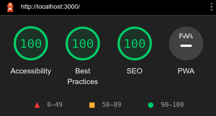

# Landing Page NextJS TypeScript

# Sumário
- [Landing Page NextJS TypeScript](#landing-page-nextjs-typescript)
- [Sumário](#sumário)
- [Sobre](#sobre)
- [Principais Tecnologias utilizadas](#principais-tecnologias-utilizadas)
- [Como rodar o projeto](#como-rodar-o-projeto)
- [Acessibilidade e SEO](#acessibilidade-e-seo)
- [Testes](#testes)
  - [Testes unitários](#testes-unitários)
- [Deploy](#deploy)
- [CI / CD](#ci--cd)

# Sobre
O projeto é uma landing page desenvolvida com NextJS 13.0, TypeScript, Styled Components e Jest. O objetivo é mostrar minhas habilidades com essas tecnologias, de forma que o site tenha uma boa acessibilidade e um bom SEO. E mostrar também a organização do código e reutilização de componentes.

O projeto foi desenvolvido utilizando o conceito de Mobile First, e também foi desenvolvido pensando em uma boa experiência de usuário, com uma boa usabilidade e um design responsivo.

Foi usado o padrão de conventional commits para fazer o versionamento do projeto.

# Principais Tecnologias utilizadas
  - NextJS 13.0
  - React
  - TypeScript
  - Styled Components
  - Jest
  - React Testing Library
  - Docker / Docker-compose

# Como rodar o projeto

<details>
  <summary>Com NodeJS</summary>

  Pré-requisitos:
  - NodeJS
  - Npm ou Yarn
  - Git

  1. Clone o repositório:
   
  ```bash
  git clone git@github.com:Brendon-Lopes/nextjs-typescript.git
  ```

  2. Acesse a pasta do projeto:
  ```bash
  cd nextjs-typescript
  ```

  3. Instale as dependências:
  ```bash
  npm install
  ```

  4. Rode o projeto:
  ```bash
  npm run dev
  ```

  4. Acesse o projeto:
  [http://localhost:3000](http://localhost:3000)
</details>

<details>
  <summary>Com Docker</summary>

  Pré-requisitos:
  - Git
  - Docker

  1. Clone o repositório:
   
  ```bash
  git clone git@github.com:Brendon-Lopes/nextjs-typescript.git
  ```

  2. Acesse a pasta do projeto:
  ```bash
  cd nextjs-typescript
  ```

  3. Build do projeto:
  ```bash
  docker build -t nextjs-typescript .
  ```

  4. Rode o projeto:
  ```bash
  docker run -d -p 3000:3000 nextjs-typescript
  ```

  5. Acesse o projeto:
  [http://localhost:3000](http://localhost:3000)

  6. Para parar o projeto:
  ```bash
  docker stop <container_id>
  ```
</details>

<details>
  <summary>Com Docker-compose</summary>

  Pré-requisitos:
  - Git
  - Docker
  - Docker-compose

  1. Clone o repositório:
   
  ```bash
  git clone git@github.com:Brendon-Lopes/nextjs-typescript.git
  ```

  2. Acesse a pasta do projeto:
  ```bash
  cd nextjs-typescript
  ```

  3. Rode o projeto:
  ```bash
  docker-compose up -d
  ```

  4. Acesse o projeto:
  [http://localhost:3000](http://localhost:3000)

  5. Para parar o projeto:
  ```bash
  docker-compose down
  ```
</details>

# Acessibilidade e SEO
O projeto foi desenvolvido visando uma boa acessibilidade, HTML semântico e um bom SEO. Para isso, foi usado o Lighthouse do Google Chrome para verificar se o site estava seguindo boas práticas, tinha uma boa acessibilidade e SEO. Tendo nota máxima em todos.



# Testes
## Testes unitários
Para os testes unitários, foi usado o Jest e o React Testing Library. Todos os componentes estão testados com <strong>100% de cobertura</strong>.

Para rodar os testes, basta rodar o comando:
```bash
npm run test
```

Para rodar os testes e ver a cobertura, rode o comando:
```bash
npm run coverage
```

Cobertura:


# Deploy
O projeto foi colocado no ar utilizando a Vercel, e pode ser acessado pelo seguinte link:

[https://hvex-nextjs.vercel.app/](https://hvex-nextjs.vercel.app/)

# CI / CD

